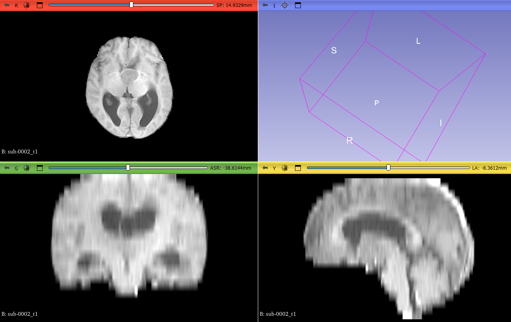
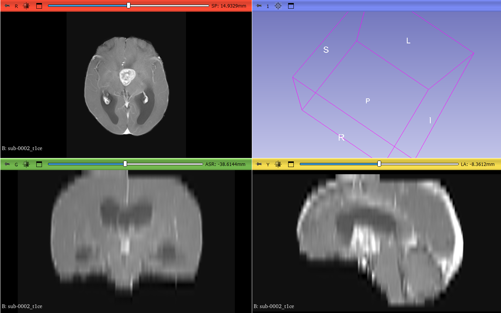
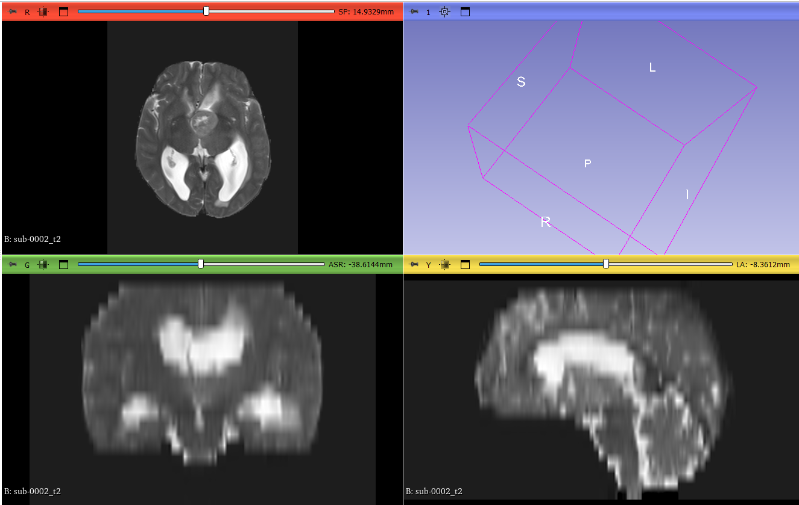
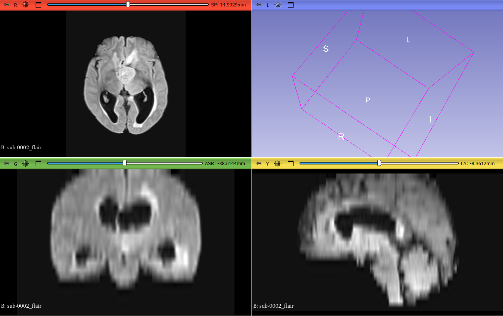

## **Background of the Paper**

The paper introduces a medical imaging dataset made from brain scans of **67 patients**. These patients have either:

* **Primary brain tumors**: Called High-Grade Gliomas (**HGGs**). These are brain cancers that start inside the brain.
* **Secondary brain tumors**: Called Brain Metastases (**BMs**). These come from other body parts (like lung or breast cancer) and spread to the brain.

Now here's the challenge:
- On **MRI scans**, these two tumor types look very similar.
- But they need different treatments.

So, how do we tell them apart without surgery or biopsy? This is where AI and radiomics come in.

## Image Modalities

**1. T1 (without contrast)**

* This is like a **plain photo** of the brain.
* It shows you the **overall shape and structure** — the brain’s normal look.
* It’s used to **line up (align)** the other images, so they all match correctly.
* Also, it helps compare what the brain looks like **before and after contrast** is added.

**Why it matters:**
Without this, doctors and computer programs can’t tell for sure:

* If something in the contrast image is really a tumor or just a normal part of the brain
* Where exactly the tumor is located within the brain

---

**2. T1-ce (with contrast)**

* This is like taking a photo **after injecting a special dye** into the blood.
* This dye **leaks into areas where the brain is damaged** — like active parts of a tumor.
* These areas **light up (look white/bright)**, so it's easier to see the tumor.

**What it shows:**

* The **core part of the tumor** (the most active or dangerous part)

**But it misses:**

* The **swelling** and **hidden parts** of the tumor that don’t take up the dye

---

**3. T2**

* This image is like using a filter that **shows water very clearly**.
* Anything with **extra water**, like swelling or fluid, shows up **bright**.
* But the problem is — **normal brain fluid also looks bright**, which can confuse things.

**Why it’s used:**

* Helps detect parts of the tumor that are soft, watery, or cyst-like
* Works as a backup to confirm the findings in other images

---

**4. FLAIR**

* This is similar to T2, but with **one big improvement**: it **hides normal brain fluid**.
* That means only **abnormal swelling and hidden tumor tissue** show up bright.
* It helps doctors or AI systems see areas around the tumor that are **swollen or invaded**.

**Very useful for:**

* Finding how far the tumor might be spreading
* Seeing **non-active** parts of the tumor

---

| Situation        | What you’ll miss without other images                                                                     |
| ---------------- | --------------------------------------------------------------------------------------------------------- |
| Only using T1-ce | You’ll **miss the swelling** and parts of the tumor that don’t glow with contrast                         |
| Only using FLAIR | You’ll **miss the active core** of the tumor and can’t be sure what's brain fluid and what's abnormal     |
| Without T1       | You **won’t know the normal brain structure**, making it hard to judge if something is unusual            |
| Without T2       | You **lose a second opinion** on swelling and fluid content — might make mistakes in FLAIR interpretation |

---


## **The MOTUM Dataset**

### Dataset Structure

* Stored in **BIDS format** 

```
motum/
├── derivatives/                  ← Contains pre-processed outputs (radiomics, segmentations, parameters)
│   ├── sub-0001/
│   │   ├── flair_param.json
│   │   ├── flair_radiomics.csv
│   │   ├── flair_seg_label1.nii.gz
│   │   ├── t1_param.json
│   │   ├── t1_radiomics.csv
│   │   ├── t1ce_param.json
│   │   ├── t1ce_radiomics.csv
│   │   ├── t1ce_seg_label2.nii.gz
│   │   ├── t2_param.json
│   │   ├── t2_radiomics.csv
│   ├── sub-0002/
│   └── ...                       ← Similar structure for each subject
├── sub-0001/                     ← Likely where raw or pre-processed NIfTI images are
│   ├── sub-0001_FLAIR.nii.gz
│   ├── sub-0001_T1w.nii.gz
│   ├── sub-0001_T1ce.nii.gz
│   ├── sub-0001_T2w.nii.gz
├── sub-0002/
├── ...
└── participants.tsv              ← (if present) may contain clinical metadata like age, sex, tumor type, etc.

```

---

### Patient Population

The patient population in the MOTUM dataset consists of **67 patients** with brain tumors. The following are the Patient Inclusion Criteria:

* Pathologically confirmed HGGs or BMs
* Imaging and clinical data collected between January 1, 2019, and January 1, 2022
* Adult patients (mostly deceased)
* Good-quality MRI scans (no major motion artifacts)
* Availability of basic clinical information (age, sex, surgery outcome, molecular data) 

All the patients divided into two major groups:

**1. High-Grade Gliomas (HGGs) – 29 patients**

These are primary brain tumors originating in the brain.

* Subtypes include:

  * Glioblastoma Multiforme (GBM)
  * WHO grade III and IV astrocytomas
  * Oligodendrogliomas

**2. Brain Metastases (BMs) – 38 patients**

These are secondary tumors that spread to the brain from other body parts.

* Origin of metastasis:

  * Lung cancer: 20 patients
  * Breast cancer: 10 patients
  * Ovarian cancer: 4 patients
  * Gastric cancer: 2 patients
  * Melanoma: 2 patients
---

###  Tumor Segmentation

1. **Manual annotation** using **ITK-SNAP** tool for first 30 patients.
2. Used these to **train a 2D deep learning model (nnU-Net)**.
3. Applied model to the remaining 37 patients.
4. Doctors **visually checked and corrected** the segmentations.

They avoided 3D models due to:

* **Slice thickness of 5mm** (2D quality better)
* **Small dataset size**

**Dice Score** (a measure of segmentation accuracy):

* NCE (non-enhancing area): **0.902**
* CE (contrast-enhancing tumor): **0.587**


### Clinical Data

Also included:

* **Age, sex**
* **Tumor origin** (lung, breast, etc.)
* **Surgery info**
* **Immunohistochemistry** results
* **Molecular data** (where available)

This adds **context** to the image data — super useful for **training models** that combine imaging + clinical info.

---

## **Radiomic Feature Extraction**

**Radiomics** is the process of turning medical images (like MRIs) into **numbers** that describe what the tumor looks like. These numbers are called **features**. They help in understanding a tumor's **size**, **brightness**, and **texture patterns**, which can be used for diagnosis, prediction, or machine learning.

This dataset used a tool called **PyRadiomics** to extract these features. Here is a flow of how it is done:


Total 110 features extracted. They are divided into 3 main types:

### 1. **Shape Features (16)**

These describe the **size** and **3D shape** of the tumor.

| Feature      | What it means                                                   |
| ------------ | --------------------------------------------------------------- |
| Volume       | How much space the tumor takes (like filling it with water)     |
| Surface area | The total outer skin of the tumor (like wrapping it in plastic) |
| Compactness  | How round or irregular the shape is                             |
| Sphericity   | How close the shape is to a perfect sphere                      |
| Elongation   | Whether it is stretched in one direction                        |
| Flatness     | How flat or thin it is                                          |
| ... (others) | Variations related to size and shape complexity                 |

These features are **geometry-based** and don’t depend on brightness.

---

### 2. **Intensity Features (18)**

These describe the **brightness and variation of pixel values** inside the tumor.

| Feature            | What it means                                              |
| ------------------ | ---------------------------------------------------------- |
| Mean               | Average brightness of the tumor                            |
| Median             | Middle brightness value                                    |
| Standard deviation | How much the brightness varies                             |
| Min / Max          | Brightest and darkest points                               |
| Energy             | Overall brightness squared (related to strength of signal) |
| Entropy            | How random the brightness is (more random = more entropy)  |
| ... (others)       | Different ways to measure pixel brightness distribution    |

These are also called **first-order features** — they don’t consider the position of pixels, just their values.

---

### 3. **Texture Features (76 total)**

These are the most important and complex. Texture features describe **patterns in the image**, based on how **pixel values are arranged**.

Let’s explain each texture group in detail.

---

#### 3.1 GLCM – **Gray-Level Co-Occurrence Matrix** (24 features)

**Purpose:** Measures **how often pairs of pixel values** appear next to each other.

| Simple idea | Imagine checking how often a dark pixel is next to a bright one |
| ----------- | --------------------------------------------------------------- |

**What it shows:**

* Whether the image is **smooth** or **rough**
* If it has a **directional pattern** (e.g., stripes, ridges)

**Features examples:**

| Feature     | Meaning                                                             |
| ----------- | ------------------------------------------------------------------- |
| Contrast    | Measures difference between neighboring pixel values (high = rough) |
| Correlation | Measures how predictable the pattern is                             |
| Energy      | How uniform or flat the texture is                                  |
| Homogeneity | If nearby pixels are similar or not                                 |

---

#### 3.2 GLRLM – **Gray-Level Run Length Matrix** (16 features)

**Purpose:** Looks at **runs (streaks) of the same pixel value** in a straight line.

\| Simple idea | Check how many rows have long runs of the same brightness (like 5 white pixels in a row) |

**What it shows:**

* **Streaks or lines** inside the tumor
* **Smooth or noisy areas**

**Features examples:**

| Feature                   | Meaning                           |
| ------------------------- | --------------------------------- |
| Short Run Emphasis        | More short streaks = higher value |
| Long Run Emphasis         | More long streaks = higher value  |
| Run Length Non-Uniformity | If runs vary a lot in length      |

---

#### 3.3 GLSZM – **Gray-Level Size Zone Matrix** (16 features)

**Purpose:** Measures **how big the connected areas are** with the same pixel value.

\| Simple idea | Instead of lines, it looks at **blobs** of the same color, and their sizes |

**What it shows:**

* Whether the tumor has **many small areas** or **a few large areas** of the same brightness

**Features examples:**

| Feature             | Meaning                                  |
| ------------------- | ---------------------------------------- |
| Small Zone Emphasis | High if there are lots of small blobs    |
| Large Zone Emphasis | High if there are fewer but bigger blobs |
| Zone Variance       | How much the blob sizes vary             |

---

#### 3.4 NGTDM – **Neighboring Gray Tone Difference Matrix** (5 features)

**Purpose:** Looks at **how different a pixel is from its neighbors**

\| Simple idea | For each pixel, check how different it is compared to the 8 around it |

**What it shows:**

* **Fine texture changes** — sharpness or blurriness

**Features examples:**

| Feature    | Meaning                           |
| ---------- | --------------------------------- |
| Coarseness | Large smooth areas = high value   |
| Contrast   | Sharp differences = high contrast |
| Busyness   | Sudden quick changes in texture   |

---

#### 3.5 GLDM – **Gray Level Dependence Matrix** (14 features)

**Purpose:** Measures **how many pixels depend on a central pixel’s value**

\| Simple idea | Group pixels that rely on the same value within a small area |

**What it shows:**

* How **tightly packed or spread out** similar values are

**Features examples:**

| Feature                   | Meaning                                         |
| ------------------------- | ----------------------------------------------- |
| Dependence Non-Uniformity | Whether all dependence groups are the same size |
| Low Gray Level Emphasis   | Many dark pixels = high value                   |
| High Dependence Emphasis  | Strong clusters = high value                    |

---


